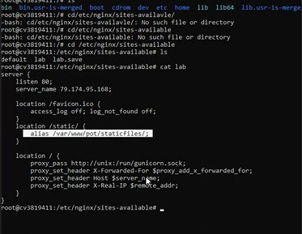
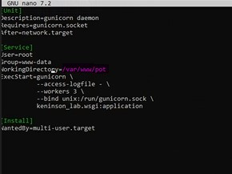
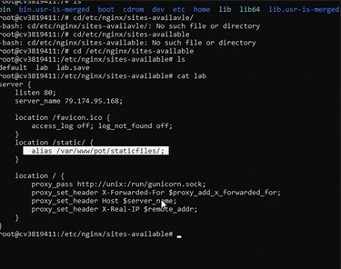
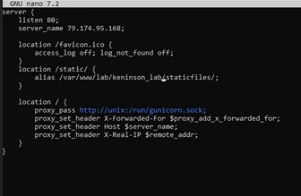

```markdown
Источники:
https://dzen.ru/a/YJl4KqX4cCax_WmM - про gunicorn, nginx, apache, wsgi
https://ru.wikipedia.org/wiki/Nginx - про Nginx WIKI
https://ru.wikipedia.org/wiki/SSL - про SSL
https://ru.wikipedia.org/wiki/WSGI - про WSGI
https://ru.wikipedia.org/wiki/SMTP - про SMTP
https://1cloud.ru/blog/django_one_server - про создание проекта
https://dvmn.org/encyclopedia/web-server/deploy-wsgi-gunicorn-django-flask/ - про демонов
https://help.reg.ru/support/servery-vps/oblachnyye-servery/ustanovka-programmnogo-obespecheniya/chto-takoye-apache#4 - про Apache
```

# Предисловие

В начале 90-х веб был статичный. По сути, на удалённом компьютере просто была 
папка с html-страницами (напр. `/var/www/`), в которой работал сервер типа Apache. 
Когда на сервер приходил запрос, например `example.com/docs/order.html`, сервер искал страницу `/var/www/docs/order.html` и отдавал её клиенту.

Но разработчикам очень хотелось иметь какую-то возможность обратной связи и аутентификации/авторизации клиентов. Для этого начали использовать скрипты, которые прописывали в атрибуте action= html-формы.


Когда поступал запрос, сервер запускал скрипт и передавал ему данные через переменные окружения. Скрипт обрабатывал запрос и отдавал серверу html через стандартный вывод, а сервер передавал его клиенту.

И всё вроде бы хорошо, веб теперь может не только отдавать данные, но и принимать их. Но есть проблема: каждый разработчик придумывал свои имена переменных окружения, тонкости процесса и т.д. Впоследствии зародилась спецификация CGI (Common Gateway Interface), которая описывает, как это всё должно происходить и называться.

# WSGI

> WSGI (англ. Web Server Gateway Interface) — стандарт взаимодействия между Python-программой, выполняющейся на стороне сервера, и самим веб-сервером[1], например Apache. (c) Wikipedia

В запускаемом приложении должен существовать вызываемый объект application, который принимает переменные окружения environ и вызываемый объект start_response, через который впоследствии будет передан ответ обратно серверу.

В Django такой объект есть в файле wsgi.py, который джанго генерирует при создании проекта:


Хорошо, допустим у нас есть сервер Apache и приложение на Python, например на фреймворке Django. Казалось, что всё хорошо. Всё, да не всё. У данный системы есть одно узкое место, а именно скорость запуска скрипта. Сам сервер работает быстро, скрипт выполняется тоже быстро. Но сам запуск интерпретатора и скрипта, загрузка этого всего в оперативную память происходит очень медленно и является так называемым “бутылочным горлышком”.

Решением данный проблемы стала предварительная загрузка (префорк) приложения в оперативную память и удержание его там. Соответственно, когда придёт запрос, он будет обработан сразу без ожидания запуска.

# Про Nginx (2004 год - основание) и Gunicorn (2010 год - основание)

Nginx не может префоркать wsgi-приложения. Но зато он может выполнять роль обратного прокси (reverse proxy), то есть умеет перенаправлять запросы на другой (локальный) сервер. Этот промежуточный сервер должен понимать HTTP, запускать WSGI-приложения и уметь префоркать их. Таким промежуточным сервером и является Gunicorn. 

То есть, Gunicorn - это минимальный веб-сервер, задача которого запускать и префоркать наше Python-приложение. Nginx стоит перед ним и когда требуется статичный файл (css, js, png и т.д.), отдаёт его клиенту, а когда нужна работа с динамическим контентом, перенаправляет запрос на Gunicorn, который сообщает детали запроса через стандарт WSGI нашему приложению.


<b>Помимо всего прочего на сервере Nginx отвечает за подключение статических файлов к проекту</b>

# Установка Django и Gunicorn

1. Сначала обновим apt-репозитории: `sudo apt update`

> apt (advanced packaging tool) — программа для установки, обновления и удаления программных пакетов в операционных системах Debian и основанных на них (Ubuntu, Linux Mint и т. п.), иногда также используется в дистрибутивах, основанных на Mandrake, например Mandriva, ALT Linux и PCLinuxOS. Способна автоматически устанавливать и настраивать программы для UNIX-подобных операционных систем как из предварительно откомпилированных пакетов, так и из исходных кодов. (c) Wikipedia

2. Теперь создаем директорию `/var/www` . Здесь у нас будут хранится все проекты на веб-сервере. В будущем между ними можно будет переключаться. Об этом позже. Сюда в папку каждого приложения желательно создавать виртуальные среды во избежании конфликтов. Команда для создания виртуального окружения: `python3 -m venv [название виртуального окружения]` . Активация: `source [название вирт. окр-я]/bin/activate`

3. Устанавливаем Django и Gunicorn:
```
pip3 install django
pip3 install gunicorn
```

4. Создание проекта. Проект можно создать как с нуля, командой `django-admin startproject [название проекта]`, так и выполнить пулл проекта с удаленного репозитория GitHub-а. Команда для пулла: `git pull [ссылка на репо]` Обратите внимание, что при создании проекта, Django автоматически создает одноименное приложение. Это приложение - точка входа в проект. В нём содержатся файлы с расширением .wsgi, именно к нему будет подключаться Gunicorn.

# Gunicorn. Конфигурационные файлы.

Gunicorn должен постоянно работать, перезагружаться в случае сбоя и автоматически загружаться при старте виртуального сервера или после перезагрузки.

В норме программы, запущенные внутри сеанса ssh будут остановлены вместе с завершением этого сеанса. Стоит пользователю отключиться от сервера и сайт сразу упадёт из-за остановки Gunicorn.

Для решения таких проблем в Linux существуют демоны — это программы, которые работают в фоне. Их запускает не пользователь, а операционная система, благодаря чему демон продолжает работать даже когда пользователь уходит с сервера. Чтобы сайт не падал Gunicorn тоже надо сделать демоном.

Systemd — система, которая управляет демонами. С её помощью вы сделаете Gunicorn демоном, а также сможете отслеживать его работу. С Systemd ваш сайт всегда будет онлайн.

В Django уже есть встроенный веб-сервер — runserver. Его используют для быстрой отладки во время разработки. Но сами же разработчики Django прямым текстом пишут о том, что использовать в продакшне его не стоит:

> DO NOT USE THIS SERVER IN A PRODUCTION SETTING. It has not gone through security audits or performance tests.

Gunicorn быстрее и заботится о безопасности. Его можно использовать в продакшне. В репозитории Django уже создала файлы `wsgi.py` и `asgi.py`. Который их них запускать? Файл `asgi.py` создан для асинхронных веб-серверов, а Gunicorn так не умеет. Используйте файл `wsgi.py`.

Воспользуемся `systemd` для создания демон-процесса (юнита) Gunicorn:
1. Устанавливаем все необходимые apt-пакеты:

```
sudo apt install python3-pip python3-dev libpq-dev postgresql postgresql-contrib nginx
```

2. Создадим пользователя для работы с gunicorn:

```
adduser user_name  - создаем пользователя
usermod -aG sudo user_name  - награждаем пользователя правами sudo
su - user_name  - переключаемся на пользователя
```

3. Создадим файл `gunicorn.service` в директории `/etc/systemd/system` и поместим в него следующие данные:

```
[Unit]
Description=gunicorn daemon
Requires=gunicorn.socket
After=network.target

[Service]
User=user_name  # тот самый пользователь
Group=www-data
WorkingDirectory=/var/www/[папка проекта до manage.py]
ExecStart=/var/www/[папка проекта до виртуалки]/venv/bin/gunicorn \
                    --access-logfile - \ 
                    --workers 3 \
                    --bind unix:/run/gunicorn.sock \ 
                    [название главной папки, в которой лежит settings.py].wsgi:application

[Install]
WantedBy=multi-user.target
```

* WorkingDirectory - это директория до расположения файла `manage.py` проекта
* ExecStart - это путь до WSGI приложения. 

3. Создадим файл `gunicorn.socket` в этой же директории и запишем следующее:

```
[Unit]
Description=gunicorn socket

[Socket]
ListenStream=/run/gunicorn.sock
SocketUser=www-data

[Install]
WantedBy=sockets.target
```

4. Активируем `gunicorn.socket`:

```
systemctl enable --now gunicorn.socket
```

5. Далее загружаем gunicorn в виртуалку, если еще там его не было. 

```
pip install gunicorn
```

6. Идем в `/var/www/[папка проекта до виртуалки]/venv/bin`. Тут должен быть файл gunicorn. Выполняем команду:

```
sudo chown user_name gunicorn  - выдаем пользователю user_name права над файлом gunicorn
```

7. Обновим список юнитов командой `systemctl daemon-reload`. Запустим вновь созданный юнит командой `sudo systemctl start gunicorn` . В последующих изменениях конфигурационных файлов gunicorn-а следует обновлять список юнитов и перезапускать gunicorn (об этом еще раз упомянем в будущем при описании работы с несколькими проектами на одном сервере):

```
systemctl daemon-reload  - обновление юнитов
sudo systemctl restart gunicorn  - перезапуск gunicorn-а
```

8. Теперь командой `systemctl enable gunicorn` установим автозапуск Gunicorn при перезагрузке сервера.

### В случае ошибок, внимательно изучаем логи:

```
sudo journalctl -u gunicorn
```

Если меняете в файлах настройки Gunicorn конфигурации, то обязательно рестартим Gunicorn

```
sudo systemctl daemon-reload
sudo systemctl restart gunicorn
```

# Установка и настройка Nginx

1. Устанавливаем Nginx из стандартных репозиториев Linux: `apt install nginx`.

2. Создадим конфигурационный файл для Nginx в директории `/etc/nginx/sites-available`:

```markdown
server {
    listen 80;
    server_name [ip];

    location /favicon.ico {
        access_log off; log_not_found off;
    }

    location /static/ {
        alias /var/www/django-test/staticfiles/;
    }

    location / {
        proxy_pass http://unix:/run/gunicorn.sock;
        proxy_set_header X-Forwarded-For $proxy_add_x_forwarded_for;
        proxy_set_header Host $server_name;
        proxy_set_header X-Real-IP $remote_addr;
    }
}
```


* listen - порт (20, 21 — FTP; 22 — SSH; 25 — SMTP; 80 порт — HTTP; 443 — HTTPS.)
* server_name - название домена (в качестве домена мы указали IP-сервера, так делать можно, если у вас нет зарегистрированного домена или нет доступа к файлу hosts.)
* location /static/ - путь до staticfiles в проекте, которая получилась вследствие команды `python3 manage.py collectstatic`

Для корректной работы статики, обязательно проверяем эту строчку: (она должна указывать на файл, в котором собрана вся статика проекта. Для спокойствия перейдите по этому адресу и убедитесь, что такая директория действительно существует).



3. Сохраним файл, создадим символьную ссылку для активации конфигурационного файла: `sudo ln -s /etc/nginx/sites-available/[название конфига в sites-available] /etc/nginx/sites-enabled/`

4. Не забудем разрешить порт прослушивания комадной `ufw allow 80`

5. Перезапускаем Nginx командой `systemctl restart nginx` и вводим в поисковую строку браузера: [IP-адрес сервера]:80. Откроется дефолтная страница Django.
   
### В случае, если проект всё ещё не отображается, проверьте следующие пункты:

* Во-первых, проверяем gunicorn командой `systemctl status gunicorn`. Его статус должен быть active.
* Во-вторых, проверяем nginx командой `systemctl status nginx`. Его статус также должен быть active. Во время проверки обращайте внимание на все исключения в логах gunicorn и nginx.
* В-третьих, Перепроверьте содержимое конфигурационных файлов `gunicorn.service` , `gunicorn.socket` , а также конфиг nginx.
* Иногда сервер может некорректно работать из-за отсутствия на нем нужных модулей для корректного отображения сайта. Установите все модули проекта из файла `requirements.txt` в среду сервера, либо устанавливайте требуемые модули по необходимости
* В случае, если все выше перепроверено и точно работает правильно, тогда дело в самом сайте и неверной его архитектуре. Заходим в файл `settings.py` и обращаем внимание на следующее:
```markdown
ALLOWED_HOSTS = ['*']  # тут прописываем наш ip сайта, либо ставим '*', что означает разрешение всем хостам.
```
Далее:
```markdown
INTERNAL_IPS = [
    '...',  # здесь прописываем свой айпи сервера.
]
```
* Проверяем, что вся статика проекта собрана: команда `python3 manage.py collectstatic`

После выполнения всех вышеперечисленных пунктов, сайт должен отобразиться по ip. Если он не отображается, то проблема в gunicorn или nginx. Если отображается отладочная страница nginx, то проблема в проекте. 

# Мультизадачность на сервере. Работа с несколькими проектами на одном веб-сервере

Веб-сервер позволяет хранить сразу несколько проектов в директории `/var/www` . Важно уметь правильно переключать запущенный проект на другой, уметь перезапускать статические файлы  

Давайте первоначально научимся смотреть, какой проект развернут на сервере в данный момент времени. Для этого можно обратиться к конфигурационному файлу `gunicorn.service`. 
```
cd /etc/systemd/system
cat gunicorn.service
```
Здесь можно посмотреть на выделенную строчку. Это будет абсолютный адрес расположения развернутого проекта.



1. Соответственно, для изменения текущего развернутого проекта на другой из директории `/var/www` необходимо поменять выделенную выше строчку на `/var/www/[название нужного проекта]` В виде адреса необходимо передать абсолютный путь до файла `manage.py` проекта. В дополнение нужно поменять расположение приложения WSGI в параметре `ExecStart=gunicorn \...\[название папки проекта Django].wsgi:application`

2. Поменяли gunicorn , теперь обновим список юнитов и перезапустим gunicorn: 
```
systemctl daemon-reload
sudo systemctl restart gunicorn
```

3. Собираем статику проекта. В директории `/var/www/<название проекта>/` - путь к расположению manage.py:
```
python3 manage.py collectstatic
```
После выполнения этой команды на уровне файла manage.py создастся директория `staticfiles`, в которой будут хранится все статические файлы проекта. При создании проекта важно придерживаться правила вынесения всей статики в эту директорию. Чтобы Django корректно искал статические файлы, в `settings.py` необходимо установить следующие параметры:

```Python
STATIC_URL = "/static/"  # это путь к каталогу, в котором веб-сервер ищет файлы статики.
STATICFILES_DIRS = [  # все директории, которые будет просматривать django при поиске статических файлов.
    BASE_DIR / "static", 
]
STATIC_ROOT = BASE_DIR / "staticfiles"  # расположение коренной папки staticfiles. 
```

4. В текстовом редакторе меняем выделенную ниже строчку на расположение папки `staticfiles` текущего проекта. (Не забываем после изменения строчки сохранить изменения. Комбинация клавиш: `ctrl + S`, `ctrl + X`)

```
cd etc/nginx/sites-available/
nano lab
``` 

```markdown
server {
    listen 80;
    server_name [ip];

    location /favicon.ico {
        access_log off; log_not_found off;
    }

    location /static/ {
        alias /var/www/django-test/staticfiles/;  # меняем эту строчку, ставим другой адрес до статики
    }

    location / {
        proxy_pass http://unix:/run/gunicorn.sock;
        proxy_set_header X-Forwarded-For $proxy_add_x_forwarded_for;
        proxy_set_header Host $server_name;
        proxy_set_header X-Real-IP $remote_addr;
    }
}
```

БЫЛО:



СТАЛО: 



6. Теперь перезапускаем Nginx командой `sudo service nginx restart`

Теперь на сервере развернут другой проект и верно отображаются все статические файлы.

# Работа с PostgreSQL на сервере

1. Первым делом ставим на сервер postgresql 

```
sudo apt install postgresql postgresql-contrib 
```

2. Далее заходим в оболочку PSQL от лица postgres

```
sudo -u postgres psql
```

3. Создаем базу данных для нашего проекта

```
CREATE DATABASE db_project;
```

4. Создаем пользователя базы данных для проекта и выбираем безопасный пароль

```
CREATE USER db_user WITH PASSWORD '1234';
```

5. Далее предоставляем пользователю все права на базу данных, а также назначаем его владельцем

```
GRANT ALL PRIVILEGES ON DATABASE db_project TO db_user;
GRANT ALL ON ALL TABLES IN SCHEMA public to db_user;
GRANT ALL ON ALL SEQUENCES IN SCHEMA public to db_user;
GRANT ALL ON ALL FUNCTIONS IN SCHEMA public to db_user;
ALTER DATABASE db_project OWNER TO db_user;
```

6. Затем выходим из оболочки

```
\q
```

7. Заходим в settings.py проекта:

```
DATABASES = {
    'default': {
        'ENGINE': 'django.db.backends.postgresql_psycopg2',
        'NAME': 'db_project',
        'USER': 'db_user',
        'PASSWORD': '1234',
        'HOST': 'localhost',
        'PORT': '',
    }
}
```

8. Создаем миграции и применяем их. Если вылазят ошибки, то удостоверьтесь, что у пользователя есть права на создание миграций.

```
sudo python3 manage.py makemigrations
sudo python3 manage.py migrate
```

9. Создаем суперпользователя

```
sudo python3 manage.py createsuperuser
```

10. При необходимости загружаем бэкапы базы. Я предлагаю через фикстуры django:

```
sudo python3 manage.py dump_data --exclude auth.permission --exclude contenttypes -o db.json  - это чтобы сделать дамп на работающей заполненной базе (исключаем бэкап конфликтующих таблиц, создающихся и заполняющихся автоматически)
sudo python3 manage.py loaddate db.json  - это чтобы загрузить бэкап
```
Конфиденциальная информация. Права принадлежат компании ©Keninson_Lab, ОАЭ Дубай, 2024.